# 🚗 Cars_DQLN

Dans mon exploratio de l'intelligence artificielle, j'ai toujours souhaité me pencher sur une technique combinant les réseaux de neurones (**deep-learning**) et le Q-learning (**Reinforcement learning**) car le mélange des deux, donnant place aux **Deep Reinforcement Learning** *(que j'abrège en DQLN pour Deep-Q-Learning-Networks)*. 

Les **DQN** ont explosé en 2015 DeepMind a battu des records sur les jeux Atari en surpassant les humains, sans connaissance particulière du jeu [LIEN DE LA VIDEO DU RECORD](https://www.youtube.com/watch?v=z48JCQZwwzA). 

J'ai donc décidé – pour mieux comprendre ces algorithmes – de développer un jeu de voiture où l'IA doit atteindre une ligne d'arrivée. Ce README explique les bases théoriques, le "pourquoi du comment", puis passe en revu les principales briques du projet.

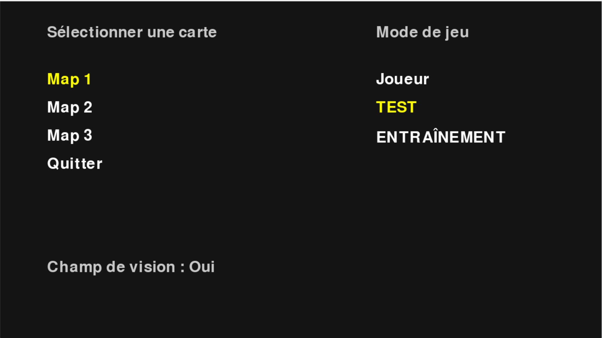

---

## 🧠 Bases Théroriques 

Tout d'abord, rappelons qu'il existe différentes catégories d'algorithmes en intelligence artificielle. On distingue principalement **les modèles supervisés, non supervisés,** ainsi que certains qui se situent à la frontière entre les deux (parfois appelés **semi-supervisés** ou **par renforcement**).

- **Un modèle supervisé** apprend à partir de données annotées. Par exemple, un dataset d’images avec des labels de classes (chien, chat, etc.). L'idée est de choisir un modèle f dont on va affiner les paramètres grâce à des algorithmes d'optimisation. J'en présente certains dans cette partie du même repo : https://github.com/JulienDesdo/AI-Projects/tree/main/theory/Levenberg-Marquardt. On peut citer le deep learning comme exemple emblématique : il ajuste les poids des réseaux de neurones progressivement au fil des itérations (via des algos comme la descente de gradient). J'explique le fonctionnement standard du deep-learning dans ce rapport :  https://github.com/JulienDesdo/AI-Projects/blob/main/theory/ADAM-MLP-Implementation/Rapport%20ADAM%20MLP-5-11.pdf. 

- **Un modèle non supervisé** n'apprend pas à partir de labels connus. Il se base uniquement sur la structure des données pour identifier des motifs ou des regroupements. Ce type d'apprentissage est souvent utilisé pour des tâches comme le clustering (voir l'optimisation mimétique, dans la partie 4 de mon rapport Monte Carlo :  https://github.com/JulienDesdo/AI-Projects/tree/main/theory/Mont-Carlo-Algorithms/Rapport-2-14.pdf) ou la réduction de dimensionnalité (PCA, largement utilisée en traitement d'images et de signaux).

- "Entre les deux", on trouve le **reinforcement learning**. Il utilise une structure bien définie (Agent, Environnement, Reward), qui ressemble à un modèle, mais ce n’est pas aussi explicite qu’une fonction mathématique claire reliant des entrées à des sorties comme en apprentissage supervisé. L’agent apprend par essais/erreurs en interagissant avec l’environnement, et c’est cette dynamique qui le distingue des autres approches classiques.

C'est pourquoi avant de parler des réseaux de neurones renforcés, je vais parler de Q-Learning. 

### Q-Learning 

   
  #### *Vocabulaire clé*
   

  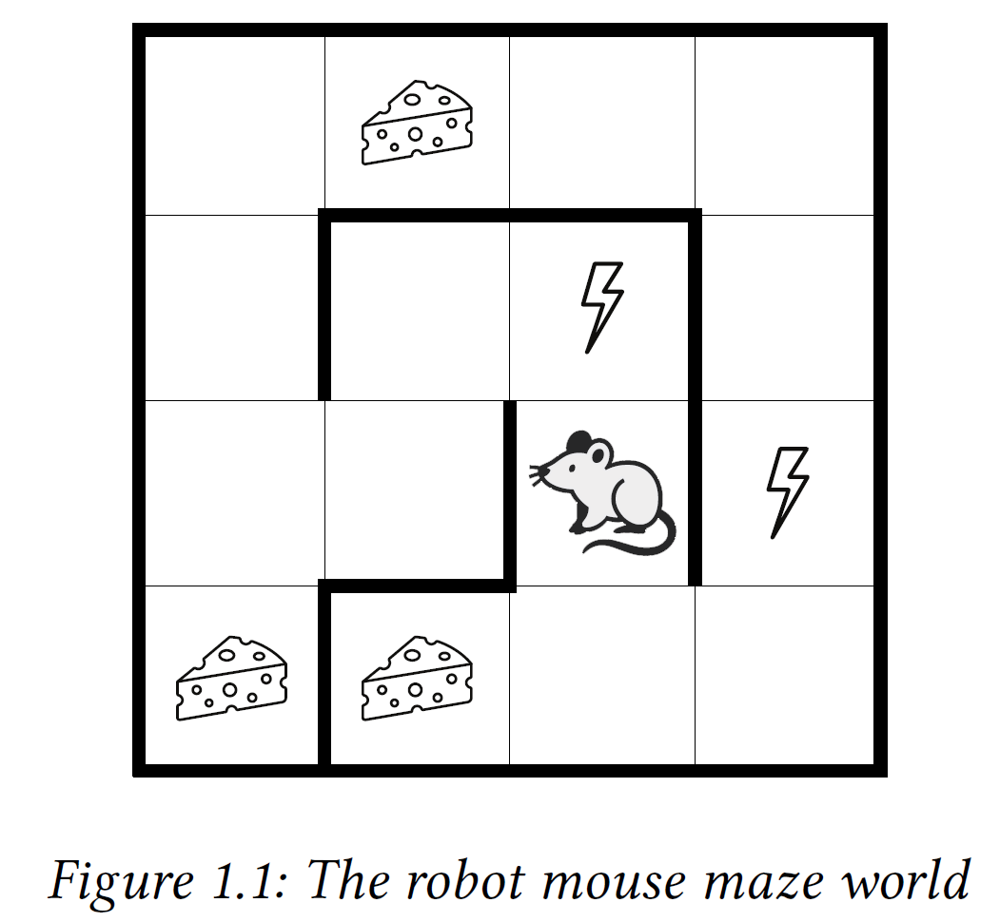
   
  Prenons l'exemple d'un souris dans un labyrinthe. La modélisation d'un environnement RL repose sur les precepts suivants : 
  
  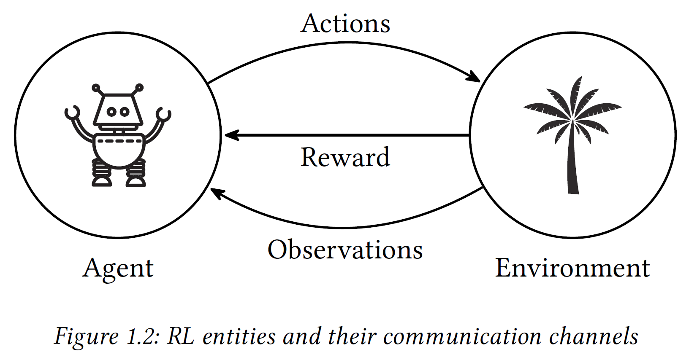  

  Travailler en Q-Learning c'est d'abord identifier qui fait quoi dans notre cas concret par rapport aux éléments théoriques nécessaires. Ici, **l'environnement (E)** est le labyrinthe car il constitue l'ensemble de toutes les case possibles. Il possède des **rewards (R)** (fromage) et des **malus** (éclair). L'agent est la souris qui se déplace dans le labyrinthe et a quatre options possibles (**actions (A)**) qu'elle peut effectuer sur l'environnement (si celui ci le permet) : aller en bas, haut, gauche, droite. Ce schéma est la base de la théorie du RL. L'idée est que l'agent va explorer son environnement et chercher à cumuler un maximum de points (reward) en evitant les malus. Le but ultime serait de chercher le "largets accumulted reward over a sequence of actions". Et du coup on peut voir le reward comme une indication à l'agent s'il est en train de réussir sa mission ou non ("Indication of agent performance"). 
  Pour faire ça on fournit des données (**observations**) à la souris pour qu'elle sache ce qu'il y a sur les cases adjacentes.   
  
 * **Note** : L'observation peut être juste pour les cases adjacentes ou un champ de vision plus large, ça dépend du design du jeu. Dans un labyrinthe simple, c'est souvent les cases adjacentes. Dans les jeux plus complexes (ex: vision 3D), ça peut être plus large. En RL classique, cela revient à connaître tout le labyrinthe (ce qu'il y a sur chaque case). Mais il existe aussi le RL partiellement observable (POMDP) pour une observabilité réduite.*  
  
L'environnement peut être représenté sous forme d'une **matrice**, où chaque case du labyrinthe correspond à un élément unique. Chaque élément de cette matrice — c’est-à-dire chaque case sur laquelle la souris peut se trouver — définit un **état** ou **state (S)**.  

En pratique, l'environnement englobe non seulement l'ensemble des états accessibles, mais aussi les règles du jeu : c'est-à-dire quelles actions sont possibles à partir de chaque état, comment l'agent peut évoluer après une action, et quelles récompenses il reçoit en fonction des choix effectués. Cette structure globale permet de modéliser de manière complète l'interaction entre l'agent et son monde virtuel, même si, pour l'instant, on se concentre simplement sur la représentation des états via la matrice du labyrinthe.
    
  #### *Chaines de Markov* 
   

**1° Markov Process (MP)**  

Pour que la souris décide vers quelle case aller à partir de sa position actuelle, on peut modéliser la dynamique de ses déplacements sous forme de probabilités : par exemple, quelle est la probabilité qu’elle atteigne telle ou telle case après une action donnée ? Notre système devient alors **une machine à états** où l’on passe d’un état à un autre selon certaines règles probabilistes : c’est ce qu’on appelle un **processus de Markov**. Voici un schéma : 

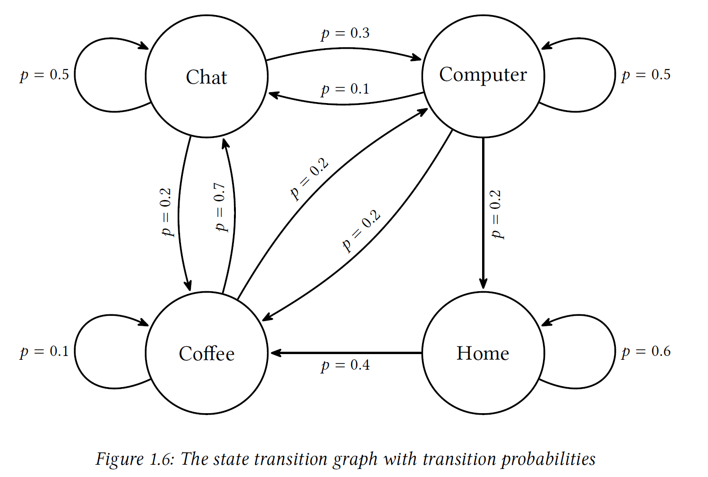

Chaque cercle est un état, pour la souris ce serait un position/case dans le labyrinthe. 

Naturellement, puisque le passage d'un état à un autre se fait en probabilités, on voit que l'on peut regrouper ces probabilités dans une matrice qui décrit totalement le système précédent. 

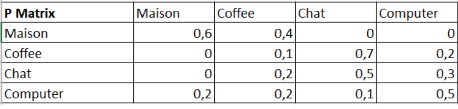
 
On appelle de cela la **matrice de transition (P)** du système. On pourrait donc dire que le systeme c'est : **l'ensemble des états (S) & la matrice de transition d'état (P)**
 
Precisions de vocabulaire : 
- **Chaine de markov** : ensemble d'états liés entre eux : state1 -> state2 -> ... -> stateN) ; 
- **History** : Séquence d'observation à travers le temps (exemple : [A, B, C, A, A, B...]) ; 
- **Episode** :  extraire l'observation de l'état de transition ;  

**2° Markov Reward Process (MRP)**  

Seulement, le problème principal de cette méthode est qu'il n'y a aucune prévoyance. En effet, si la souris a le choix entre un éclair en haut et un fromage en bas. Mais que dans le premier cas, l'éclair est suivi de 100 fromages et dans l'autre suivi de 100 éclairs. La souris choisira un fromage et 100 eclairs. Ce qui donne une souris grillée. 
C'est pouquoi on introduit les **MARKOV REWARD PROCESS**. On introduit une variable aléatoire qui symbolise le gain de l'agent sur une episode. Cela s'écrit : 

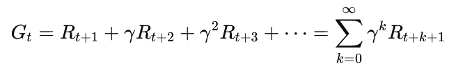

**γ est le facteur de prévoyance de l'agent entre 0 et 1**. Cela a pour but d'évaluer la valeur d'un état que l'on choisit en tenant compte de récompenses à plus ou moins long terme. Evaluer les recompanses à long terme sur un episode c'est approcher γ de 1, sinon rapprocher γ de 0 c'est choisir le gain maximum immédiat au risque d'y perdre plus (c'est le cas précédent). La value of state V(s) s'exprime : 

![Equation V(S) = E[G | St=s]](images-doc/value-of-state.png) 

On peut réécrire cette formule un peu abstraite en une qui s'applique directement au cas du système à état :  
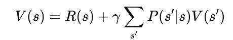

Il s'agit de l'**équation de Bellman simplifiée pour le cas MRP (markov reward process)**. En analysant la formule on voit bien que tout notre procédé revient à obtenir le systeme suivant : 
 
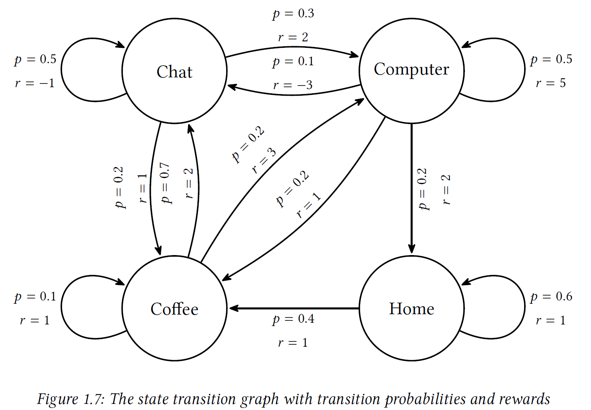
 
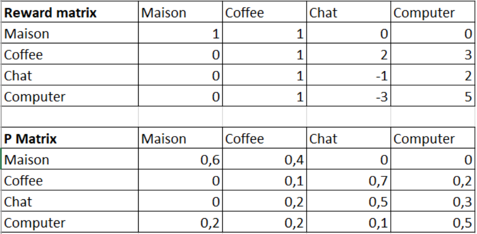

**Notre systeme MRP se formule (S,P,R,γ)**   

Voici un **exemple** pour être un peu didactique :  
États : S={A,B}, R(A)=5, R(B)=10, P(A∣A)=0.7, P(B∣A)=0.3, P(A∣B)=0.4, P(B∣B)=0.6. 
 
En appliquant l'équation de Bellman pour MRP, on a : 

V(A)=5+0.9×[0.7V(A)+0.3V(B)]  
V(B)=10+0.9×[0.4V(A)+0.6V(B)]  

**3° Markov Decision Process (MDP)**  

**Système Complet**

Un dernier point important apparaît naturellement : comment l'agent doit-il agir ? Dois-je, en tant que souris, explorer de nouvelles zones du labyrinthe (au risque de tomber sur un piège), ou bien exploiter ce que je connais déjà pour maximiser mon gain immédiat ?

 Ce dilemme entre exploration et exploitation est central en apprentissage par renforcement.

Pour modéliser ça, on utilise ce qu'on appelle un Markov Decision Process (MDP). C’est la suite logique du MRP, sauf qu’ici on prend en compte les actions de l'agent. Dans un MDP :  

- À chaque **état s**, l'agent peut choisir une **action a** parmi un ensemble d’actions possibles.
- Chaque **couple (s,a)** conduit à une transition vers un nouvel état s′ avec une probabilité P(s′∣s,a), et offre une récompense R(s,a).

Résultat : le système devient une **matrice à trois dimensions** : Pour un état s on possède plusieurs actions réalisable. Dans le cas de la souris, on a une **matrice tri-dimensionnelle de taille 4x4x4 (longueur x largeur x actions)**. 

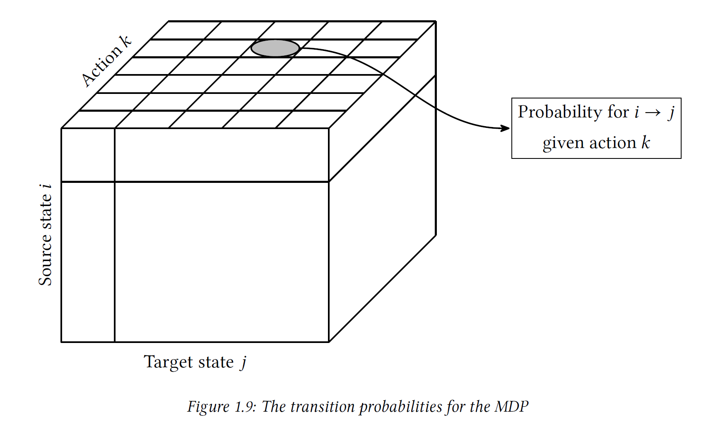

La question est maintenant de savoir ce que contient cette matrice ? Elle contient en réalité les Q-values, qui aide à la prise de décision à l'aide de la politique. 

**Equation de Bellman**

Mais au fait, ces fameuses Q-values, c’est quoi ?

Eh bien c’est là qu’arrive l'équation de Bellman, qui fait le lien entre tout ce qu’on a vu avant : état, action, récompense, probabilité de transition. L’idée : calculer pour chaque couple (état, action) la “valeur” de cette action (ce qu’on peut espérer gagner en la prenant).

- **γ** est le facteur de prévoyance (déjà vu avant).
- La somme parcourt tous les états accessibles après **(s,a)**, avec la meilleure action suivante.
- **π** est la politique (expliqué dans la suite). 

Concrètement, dans notre exemple de la souris, à chaque case s, elle peut aller en haut, bas, gauche, droite. On a donc pour un état s donnée : **Q(s,haut), Q(s,bas), Q(s,droite), Q(s,gauche)**. 

 

**Politique**

La politique consiste donc à sélectionner une valeur Q-value à un état s, donc choisir une action à effectuer pour stocker la Q-value associée. Simplement **Politique : Stratégie pour choisir les actions a**. Mais qu'est ce qu'une bonne politique ? Comment la choisir ?  

Tout dépend de ce que l'on veut faire, tout d'abord rappelons que même si γ est surtout le facteur de prévoyance, il a aussi un impact indirect sur l'exploration. En effet : 
 - γ proche de 0 → l’agent ne cherche que le gain immédiat (exploration très locale).
 - γ proche de 1 → il regarde loin dans le futur et peut apprendre des stratégies globales même s'il n'a pas exploré tout à fond. Pour faire simple, les états peu visités peuvent être “appris par approximation” grâce à la propagation des valeurs via γ.  

En théorie, pour apprendre correctement, chaque couple (état, action) doit être exploré suffisamment. Mais en pratique, **quand γ est élevé, l’agent peut “deviner” ou approcher la valeur de certains états peu visités, car les récompenses futures se propagent dans le calcul via l'équation de Bellman.**

La politique est à la fois la sélection des Q-value pour un bon apprentissage. Mais tout dépend de ce que l'on veut faire. A la manière de γ qui permet soit une exploration gloal ou locale, la politique permet de faire la même chose.  

On a :  
- **Greedy** : choisir toujours l’action qui a la meilleure Q-value. A utiliser une fois que l'on a suffisement appris. π(s) = argmax[a] (Q(s,a))
- **Epsilon-Greedy** : on choisit un action aléatoire avec un paramètre epsilon (exploration) ou on minimise Q(s,a) (exploitation)
- **Déterministe** : toujours la même action pour un état donné. π(s)=a
- **Stochastique** : on tire au hasard en fonction d’une proba. π(a/s) = P(At=a/St=s)

Ainsi selon notre choix de politique on fait soit :  
- De **l'exploration** : tester de nouvelles actions pour découvrir des chemins ou des stratégies qu’on ne connaît pas encore.
- De **l'exploitation** : utiliser ce qu’on a déjà appris pour maximiser le gain à court terme.

L’exploration permet d’éviter de passer à côté d’une meilleure solution (même si ça peut coûter cher sur le moment), alors que l’exploitation permet de capitaliser tout de suite sur ce qu’on pense être la meilleure stratégie. Trouver le bon équilibre entre les deux est essentiel pour apprendre efficacement. **C’est donc un enjeu majeur pour tout système RL, y compris dans des méthodes avancées comme les DQN ou PPO, où l’on cherche à apprendre des politiques plus sophistiquées pour mieux gérer ce compromis.**  

**Programmabilité** 
 
À partir de là, le schéma est clair :  
1️⃣ Pour un état s, je calcule Q(s,a) pour toutes les actions.  
2️⃣ Je choisis mon action selon la politique.  
3️⃣ Je fais l’action, j’observe la récompense + le nouvel état.  
4️⃣ Je mets à jour Q(s,a).  
5️⃣ Je recommence.  

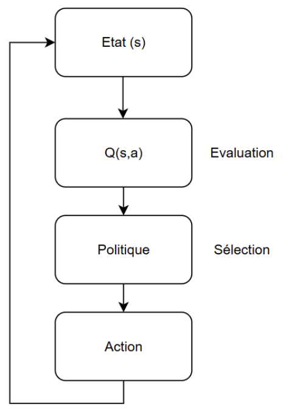

Pour ce qui est de la Q-table au début on l'initilise soit à 0 soit avec des valeurs aléatoires. Qu'en est t il des matrices (R) et (P) ? 
Dans les cas pratiques on ne connait pas forcement les matrices de transitions. Donc : 
- Cas où R et P sont connus : on peut appliquer directement Bellman (programmation dynamique, itération de valeur, etc.). C'est l'équation de Bellamn. 
- Cas où R et P sont inconnus (la norme en pratique) : → on apprend en essayant : Q-learning (l'agent découvre tout seul les “poids” réels de R et P).

A noter que j'ai supposé que les fonctions P(s′ ∣ s,a) et R(s,a) sont connues. C'est le cas "idéal" où l'environnement est parfaitement modélisé, ce qui permet d'appliquer directement l'équation de Bellman. Ces informations sont en fait souvent inconnues : l'agent doit les découvrir par essai/erreur (ex : Q-learning). On différencie donc : 

| **Type de RL**                 | **Modèle connu (modèle-based RL)**                                                                 | **Modèle inconnu (modèle-free RL)**                                               |
|---------------------------------|---------------------------------------------------------------------------------------------------|-----------------------------------------------------------------------------------|
| **Définition**                  | L'agent connaît la fonction de transition \( P(s'/s,a) \) et la récompense \( R(s,a) \).         | L'agent ne connaît ni \( P \) ni \( R \).                                         |
| **Méthode d'apprentissage**     | Utilise directement les équations théoriques (ex : Bellman).                                      | Apprend en expérimentant (essai/erreur).                                          |
| **Exemples d'algos**            | Programmation dynamique, Value Iteration, Policy Iteration.                                       | Q-learning, SARSA, DQN, PPO...                                                    |
| **Avantages**                   | Solution exacte si le modèle est parfaitement connu.                                             | Plus flexible : fonctionne même sans modèle précis.                               |
| **Inconvénients**               | Nécessite de connaître l'environnement (souvent irréaliste).                                      | Peut être long à apprendre et nécessiter beaucoup d'essais.                       |

 

  #### Limites du Q-Learning 
    

Dans le cas de notre jeu de voiture, on se rend vite compte des limites du Q-Learning classique :  
- **Environnement trop grand** : Si l’espace des états est énorme (par exemple, chaque case du circuit + la vitesse + l’angle + plein d'autres paramètres), la Q-table devient ingérable : il faut mémoriser chaque combinaison état-action.
- **Scalabilité limitée** : Si l’état est une image (par exemple une vue du circuit en 2D ou 3D), c’est encore pire : impossible de stocker toutes les combinaisons image/action dans une simple table → explosion mémoire garantie.
- **Généralisation impossible** : Le Q-learning ne généralise pas : deux états très proches (par ex. une voiture en (x=10,y=50,v=80 km/h)(x=10,y=50,v=80km/h) et une autre en (x=10.1,y=50,v=80 km/h)(x=10.1,y=50,v=80km/h)) sont traités comme des états totalement différents. ➔ Résultat : **Q(s1,a)≠Q(s2,a) même si s1≈s2**. Le Q-learning ne fait aucune différence : il ne "comprend" pas que ces deux états sont presque identiques.
- **Exploration inefficace** : Dans un environnement très grand, l'agent va passer son temps à explorer des zones qui n'ont aucun intérêt. Il risque de passer à côté des bonnes zones ou d'apprendre trop lentement.
 

La conséquence ? Le Q-learning classique ne passe pas à l’échelle dès que l’environnement devient un peu trop complexe ou riche.  

#### Solution : Deep Q-Network (DQN)

L’idée clé est de remplacer la Q-table par un réseau de neurones profond (DNN) qui approxime Q(s,a)Q(s,a).Au lieu de stocker une valeur par (état, action), le modèle apprend une fonction qui prédit la Q-value à partir de l’état et de l’action.  

Avantages :  
- **Capacité de généralisation** : des états proches donneront des Q-values similaires.
- **Scalabilité** : peut gérer des entrées complexes comme des images (ex : une caméra embarquée sur la voiture).
- **Apprentissage plus efficace** : le réseau partage l'information entre états similaires, ce qui évite de devoir tout explorer case par case.

### Deep-Q-Networks 

Comme expliqué précédemment, dans le DQN, la Q-Table est remplacée par un réseau de neurones profond. Le réseau apprend à approximer la fonction Q-value :

[loss-formula-Q-network](images-doc/loss-formula-Q-network.png)

Pour rappel : 
- **θ** : les paramètres (poids) du réseau principal (policy network),
- **θ−** : les paramètres du réseau cible (target network),
- **R** : la récompense obtenue,
- **γ** : facteur de prévoyance,
- **s,a** : état et action courante,
- **s′,a′** : état suivant et toutes les actions possibles.

L'objectif est de réduire la différence entre ce que le réseau estime Q(s,a) et ce qu'il “devrait” valoir selon Bellman (la cible).

Dans l'idée : 
[neural-network-Q-values](images-doc/neural-network-Q-values.png)

Mais on rencontre plusieurs problèmes.
- **Probleme : Corrélation temporelle entre expériences** : Quand on utilise juste un réseau, chaque nouvelle expérience influence directement l’apprentissage ➔ cela crée une corrélation temporelle forte entre les expériences consécutives, ce qui peut rendre l’apprentissage instable.
- **Solution : Experience Replay** : On stocke toutes les expériences passées sous forme de tuples (s,a,r,s′)(s,a,r,s′) dans une mémoire tampon (replay buffer). Lors de l’apprentissage, on échantillonne aléatoirement des mini-lots à partir de ce buffer. ➔ Cela brise la corrélation temporelle entre expériences successives et rend l’apprentissage plus stable.
- **Problème : Instabilité des cibles Q** : Si on met à jour en permanence le même réseau pour prédire ET évaluer les cibles Q(s′,a′), le modèle peut devenir instable ou même diverger.
- **Solution : Target Network** : On introduit un second réseau stable, le target network. Ce réseau est copié périodiquement (tous les N épisodes par ex.) à partir du réseau principal. Cela permet de garder des cibles fixes pendant un certain temps, ce qui stabilise l'apprentissage. 

On a donc 2 réseaux de neurones : 
- **Policy Network (réseau principal)** : celui qui est entraîné activement pour approximer Q(s,a)
- **Target Network (réseau cible)** : une copie figée temporairement du policy network, utilisée pour calculer la cible de Bellman.

[schema-DQN](images-doc/schema-DQN.png) 

Etapes du proessus DQN : 
1️⃣ Policy Network (Entraînement) : Le réseau principal prend en entrée un état (par ex. la position de la voiture sous forme de vecteur ou image) et prédit les Q-values pour toutes les actions possibles.  
2️⃣ Target Network (Cible) : Sert à calculer la cible Bellman R+γmax⁡a′Q(s′,a′)R+γmaxa′​Q(s′,a′) avec des poids figés.  
3️⃣ Action : L'agent choisit une action selon sa politique (par ex. epsilon-greedy) et l’exécute dans l’environnement.  
4️⃣ Stockage : On stocke (s,a,r,s′)(s,a,r,s′) dans la Replay Memory.  
5️⃣ Apprentissage : À chaque itération, on échantillonne un mini-lot d’expériences du buffer, on passe les états dans le policy network, on calcule les cibles via le target network, et on met à jour les poids du policy network par rétropropagation.  
6️⃣ Mise à jour périodique : Tous les N épisodes, on copie les poids du policy network dans le target network.  
7️⃣ 🔁 Répéter le processus jusqu’à convergence.  

Référez-vous à cette vidéo pour entrer plus dans les détails :
🎥 [Deep Q-Learning/Deep Q-Network (DQN) Explained | Python Pytorch Deep Reinforcement Learning](https://www.youtube.com/watch?v=EUrWGTCGzlA)

---

## 🛠️Programme

Concretement : Libs de reinforcement, stable baseline pour les réseaux de neurones. 
Diagramme de classes ? 
Fonctionnalités. 

---

## 📚 Références & Liens Utiles 

- **Deep Reinforcement Learning Hands-On**, *Maxim Lapan*, Third Edition, Packt — *A practical and easy-to-follow guide to RL, from Q-Learning and DQNs to PPO and RLHF.*
- **Pygame Documentation 1** : [https://he-arc.github.io/livre-python/pygame/index.html](https://he-arc.github.io/livre-python/pygame/index.html)
- **Pygame Documentation 2** : [https://www.pygame.org/news](https://www.pygame.org/news)
- **OpenAI Spinning Up (Reinforcement Learning guide)** : [https://spinningup.openai.com/en/latest/](https://spinningup.openai.com/en/latest/)
- **Stable-Baselines3 (Reinforcement Learning Library)** : [https://github.com/DLR-RM/stable-baselines3](https://github.com/DLR-RM/stable-baselines3)
- **YouTube Videos :**  
  - [Google's DeepMind AI Just Taught Itself To Walk](https://www.youtube.com/watch?v=gn4nRCC9TwQ)  
  - [AI Learns to Speedrun Mario](https://www.youtube.com/watch?v=OQitI066aI0)  
  - [MarI/O - Machine Learning for Video Games](https://www.youtube.com/watch?v=qv6UVOQ0F44&t=185s)
- **Github / Simulations IA (Jean Buffer)** — Vidéos de simulation par IA + code source : [https://github.com/johnBuffer](https://github.com/johnBuffer)
