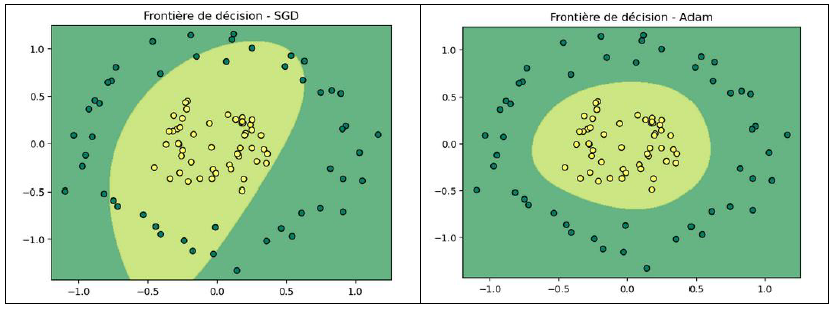

# 🧠 Comparaison d’Optimiseurs : MLP avec Adam vs SGD

Ce projet implémente un MLP **entièrement codé à la main** (forward et backpropagation) pour comparer deux stratégies d’optimisation : **SGD** (Stochastic Gradient Descent) et **Adam**.
Les optimiseurs modernes comme ADAM, Adagrad, RMSprop ajustent dynamiquement le taux d'apprentissage pour améliorer la convergence. 

🎯 **Objectif** :  
Comprendre l’influence de l’optimiseur sur l’apprentissage d’un réseau de neurones, en particulier la vitesse et la qualité de convergence.

🔍 **Approche** :  
- Mise en œuvre d’un MLP minimaliste (une couche cachée)
- Comparaison entre deux runs :  l'une avec **SGD**, l'autre avec **ADAM**. 
- Visualisation des zones de décision pour chaque modèle

📈 **Conclusion** :  
Les résultats montrent clairement qu’**Adam s’adapte mieux** à la topologie du problème, confirmant ses avantages dans des contextes à faible tuning ou à géométrie complexe.

🖼️ Exemple de sortie :  

📄 Pour plus de détails sur les fondements théoriques, le choix des paramètres et les résultats expérimentaux :  
[📘 Rapport complet (PDF)](./Rapport%20ADAM%20MLP-5-11.pdf)
