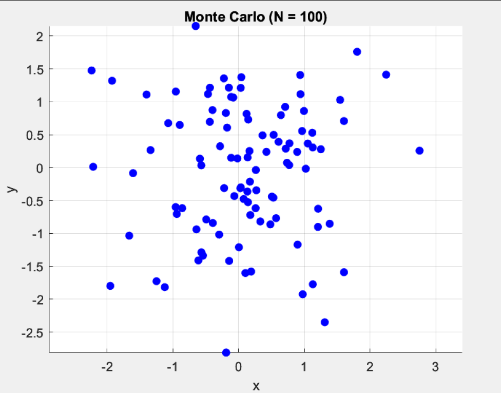
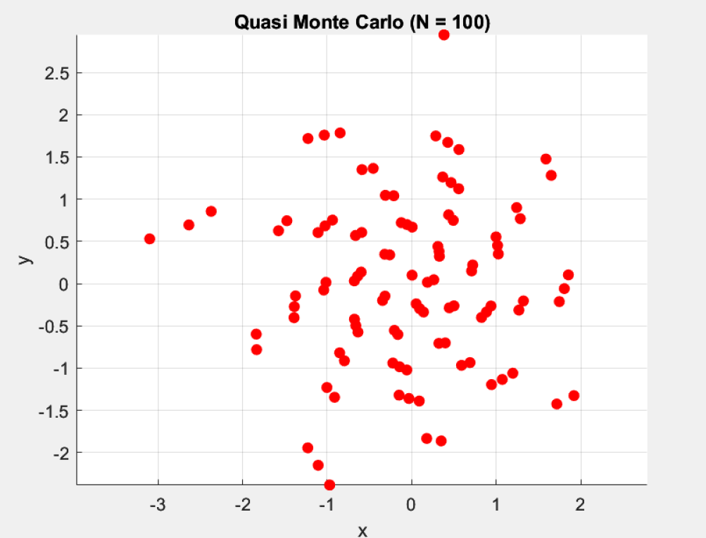
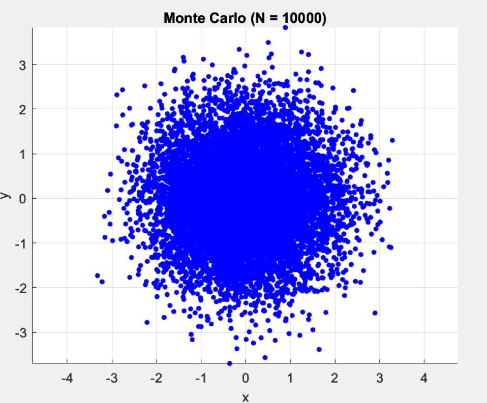
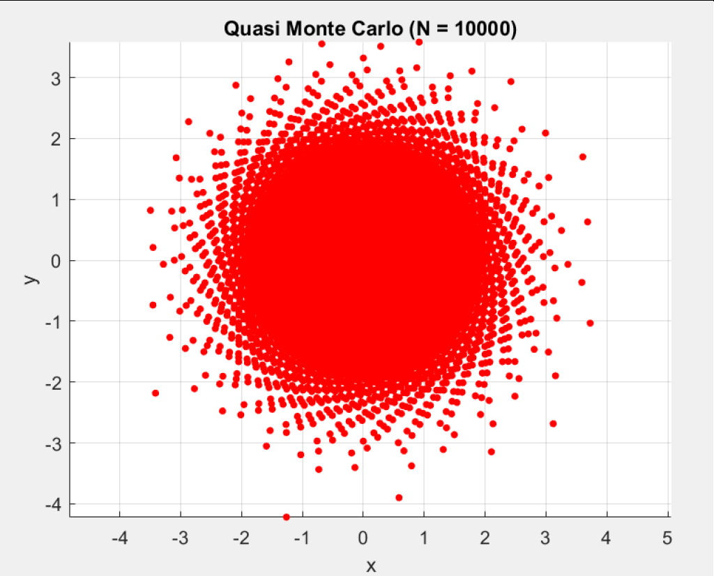
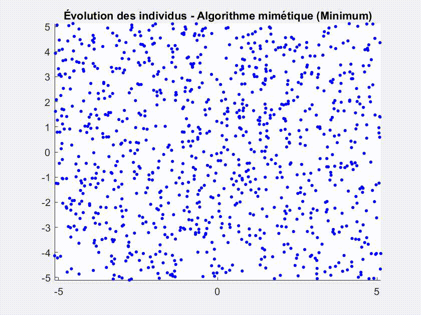
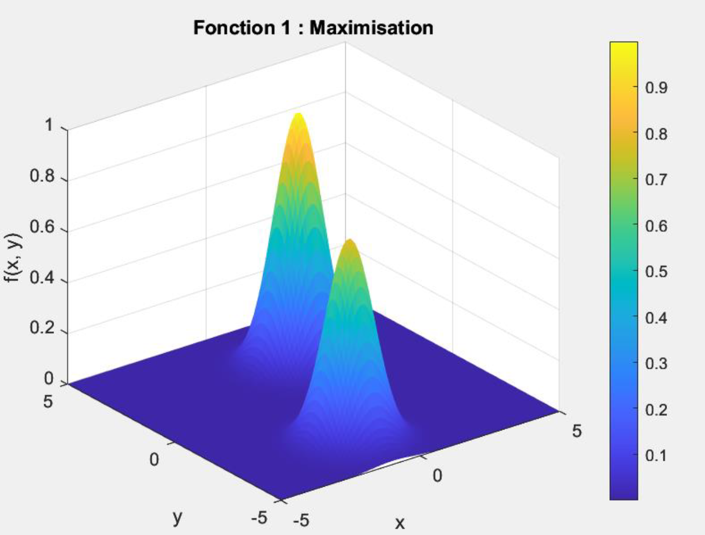
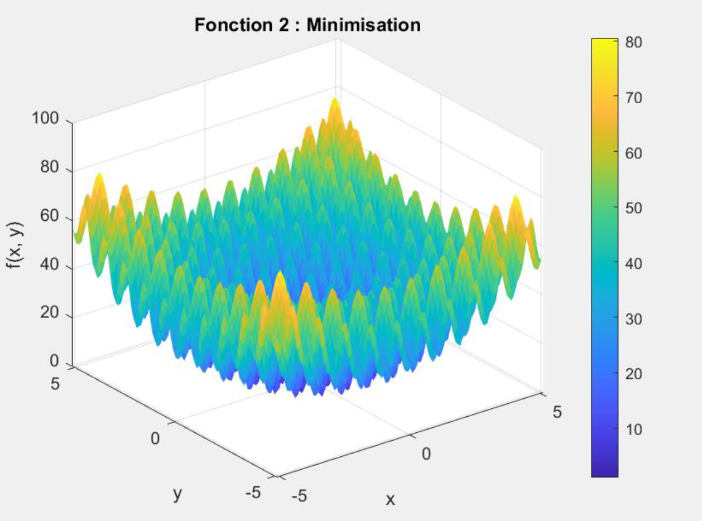

# 🎲 Monte Carlo & Quasi-Monte Carlo Algorithms

Ce projet explore plusieurs approches numériques d'approximation : intégration, visualisation, et optimisation à l’aide des méthodes de **Monte Carlo** et **Quasi-Monte Carlo**, avec des cas illustratifs concrets.  
Le code est écrit en **Matlab**, organisé par thème (intégration, surface, optimisation mimétique).

---

## 🧪 Objectifs et contenus

### 🔢 Partie 1 : Intégration numérique

Première phase du TP : estimer la surface d’une fonction en 2D, en utilisant différentes stratégies d’échantillonnage et de moyenne.  
On cherche à approximer des intégrales doublement continues sur des domaines complexes.

### 🔍 Partie 2 : Quasi-Monte Carlo

On estime des intégrales via des points aléatoires tirés dans des domaines simples (rectangle, disque), en s’intéressant à la variance de la méthode.  
Les résultats sont confrontés à des calculs analytiques quand ils sont disponibles.

---

## 🟢 Partie 3 — Quasi-Monte Carlo et quantification

Cette section améliore l’échantillonnage en utilisant des séquences **Quasi Monte Carlo** (ex : Sobol ou Halton), qui remplissent mieux l’espace.  
On observe des différences nettes en termes de précision et régularité selon la méthode employée.

| Monte Carlo (N=100) | Quasi Monte Carlo (N=100) |
|----------------------|----------------------------|
|  |  |

| Monte Carlo (N=10 000) | Quasi Monte Carlo (N=10 000) |
|-------------------------|-------------------------------|
|  |  |

---

## 🍄 Partie 4 — Optimisation mimétique (algorithme des champignons)

On implémente un algorithme d’**optimisation inspiré du comportement de colonies** : les **"champignons"** se déplacent dans l’espace à la recherche du maximum ou minimum d’une fonction.

Les résultats sont visibles via :

| 🎥 Animation Maximum | 🎥 Animation minimum |
|-------------------|-------------------|
|  |  |

Et visualisés en 3D :

| Fonction 1 (max) | Fonction 2 (min) |
|------------------|------------------|
|  |  |

L’algorithme repose sur la capacité de particules à **communiquer indirectement via leur position**, et à évoluer vers les zones prometteuses.  
Une implémentation simple mais illustrant bien les principes d’optimisation stochastique.

---

## 📌 Remarques

- Le projet s’appuie sur des bases théoriques robustes (voir le rapport joint).
- Les méthodes QMC permettent un meilleur recouvrement de l’espace pour une même complexité.
- Le rendu visuel (animations, clustering, 3D) rend les différences plus parlantes que des équations.

📄 Pour plus de détails, démonstrations et justifications, le rapport complet est disponible dans le dépôt.
